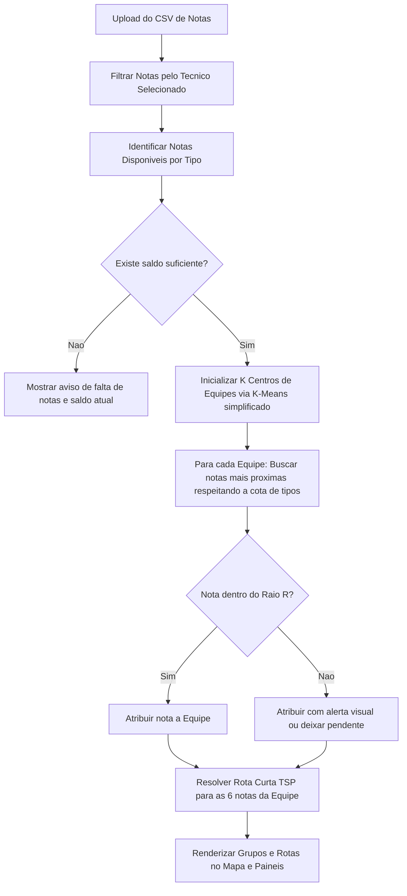

# Plano de Implementacao: Agrupador de Notas Geografico (Ordens de Servico)

Este plano descreve a arquitetura, algoritmo e interface de usuario para o **Agrupador Inteligente de Notas**, resolvendo o problema de divisao de ordens de servico por equipes com base em restricoes geograficas, especialidades (tipos de notas) e capacidade por equipe.

---

## 1. Analise e Sugestoes de Melhoria

A sua ideia inicial e excelente e resolve um problema classico de logistica de campo (Roteamento de Veiculos / Agrupamento com Restricao de Capacidade). Para tornar esta ferramenta extremamente eficiente, robusta e facil de usar no dia a dia, sugerimos as seguintes **melhorias estruturais e algoritmicas**:

### 1.1. Tratamento de Restricoes Flexiveis (Soft Constraints)
No mundo real, as coordenadas das notas nem sempre se encaixam perfeitamente nos limites definidos. Se voce exigir **rigorosamente** 4 MDFC e 2 ALGC dentro de um raio rigido de $X$ metros, existem tres grandes riscos:
*   **Ausencia de Solucao:** O algoritmo pode falhar se nao houver exatamente essa proporcao de notas proximas geograficamente.
*   **Sobras Isoladas:** Algumas notas muito distantes ficarao sem equipe (orfas).
*   **Ineficiencia:** Equipes podem cruzar caminhos desnecessariamente para satisfazer a cota rigida de tipos.
*   > [!TIP]
    > **Melhoria Proposta:** Implementar um **algoritmo heuristico adaptativo** com prioridades. O sistema tentara alcancar a meta exata (ex: 4 MDFC + 2 ALGC). Se nao for possivel dentro do raio configurado, ele podera:
    > 1. Buscar a nota do tipo requerido mais proxima, mesmo que ultrapasse ligeiramente o raio, sinalizando um alerta visual.
    > 2. Sugerir uma composicao alternativa (ex: 3 MDFC, 3 ALGC) se estiver geograficamente mais compacta.
    > 3. Deixar a vaga em aberto e criar um grupo "Pendente" para que o supervisor decida.

### 1.2. Otimizacao de Rota Interna (Traveling Salesman Problem - TSP)
Uma vez que o grupo de 6 notas e atribuido a uma equipe, a ordem em que elas sao executadas importa muito para reduzir o tempo de deslocamento.
*   > [!TIP]
    > **Melhoria Proposta:** Apos agrupar as 6 notas de uma equipe, ordenar as notas de forma a **minimizar a distancia total percorrida** (resolvendo o problema do caixeiro viajante para as 6 notas). O mapa desenhara a linha sugerida conectando os pontos de 1 a 6.

### 1.3. Ajuste Manual Interativo (Drag and Drop / Clique no Mapa)
Algoritmos sao otimos, mas a intuicao do supervisor e insubstituivel. Podem existir barreiras geograficas reais que o algoritmo nao ve (rios, rodovias de acesso dificil, etc.).
*   > [!IMPORTANT]
    > **Melhoria Proposta:** Permitir que o usuario clique em uma nota atribuida a Equipe A no mapa e a **transfira manualmente** para a Equipe B. O sistema ira recalcular instantaneamente as metricas de ambas as equipes (composicao, raio maximo e rota).

### 1.4. Analise de Viabilidade Previa (Indicadores em Tempo Real)
*   **Melhoria Proposta:** Antes de rodar o agrupamento completo, mostrar um painel com o balanco geral da base importada:
    *   Total de notas do Tecnico selecionado por tipo.
    *   Comparativo: Necessidade Total (ex: 10 equipes $\times$ 4 MDFC = 40 MDFC necessarias) vs. Disponibilidade Real (ex: 38 MDFC importadas). Se faltarem notas, avisar o usuario imediatamente antes do processamento.

---

## 2. Arquitetura da Aplicacao Proposta

Propomos uma **Aplicacao Web Monopagina (SPA)** moderna, rapida e visualmente deslumbrante, rodando inteiramente no navegador (sem necessidade de servidor complexo para o processamento, garantindo privacidade dos dados e velocidade instantanea).

### 2.1. Tecnologia Stack
1.  **Interface e Estrutura:** HTML5 e Javascript Moderno (ES6+).
2.  **Estilo & Design:** Vanilla CSS com variaveis para um tema escuro/claro elegante, efeitos de Glassmorphism (efeito vidro), transicoes suaves e layout responsivo.
3.  **Visualizacao de Mapas:** [Leaflet.js](https://leafletjs.com/) (biblioteca leve de mapas interativos de alto desempenho) integrada com OpenStreetMap.
4.  **Processamento Algoritmico:** Heuristica de agrupamento baseada na distancia de Haversine (calculo de distancia em linha reta sobre a superficie da Terra considerando a curvatura terrestre).

---

## 3. Estrutura do Projeto [NEW]

Criaremos o projeto no diretorio scratch do usuario sob a pasta:
`C:\Users\josep\.gemini\antigravity\scratch\agrupador-notas`

```
agrupador-notas/
|-- index.html          # Interface principal estruturada e semantica
|-- index.css           # Design System, variaveis CSS, temas e animacoes
|-- app.js              # Controlador principal da aplicacao e mapa
|-- algorithm.js        # Motor de agrupamento geografico inteligente e TSP
`-- sample_data.csv     # Arquivo de exemplo para o usuario testar a ferramenta
```

---

## 4. O Algoritmo de Agrupamento Proposto (Passo a Passo)

O motor contido em `algorithm.js` operara da seguinte forma:



1.  **Haversine Distance:** Calculo exato em metros entre as coordenadas GPS das notas.
2.  **K-Means Centroid Seeding:** Identifica os pontos mais densos da base para posicionar as equipes (ex: se precisamos de 10 equipes, achamos os 10 "centros de gravidade" de notas).
3.  **Typed Greedy Assignment:** A partir dos centros, o algoritmo expande em espiral buscando os tipos necessarios (ex: os 4 MDFCs mais proximos do centro, depois os 2 ALGCs mais proximos).
4.  **TSP Local:** Aplicacao do algoritmo do vizinho mais proximo para organizar as 6 notas em um caminho fluido.

---

## 5. Mockup Visual e Recursos Premium da UI

A interface sera construida seguindo as diretrizes de **Design Premium** do Antigravity:
*   **Dark Mode Nativo:** Fundo escuro profundo (`#0f172a`), com cartoes translucidos (`backdrop-filter: blur()`).
*   **Cores Harmoniosas:** Cada tipo de nota tera uma cor neon suave correspondente no mapa (ex: MDFC = Azul Ciano `#06b6d4`, ALGC = Esmeralda `#10b981`, APRO = Roxo `#a855f7`).
*   **Mapa Interativo:** Mapa ocupando 60% da tela, com marcadores customizados e linhas de rota elegantes ligando as notas de cada equipe.
*   **Painel Lateral de Configuracao:**
    *   Area de upload (Drag & Drop) com feedback animado de linhas carregadas.
    *   Seletores dropdown para escolher o Tecnico.
    *   Configuracao do Raio Limite (Slider de 100m a 10km).
    *   Tabela interativa para definir a regra de composicao (ex: "Quantas notas de cada tipo por equipe?").
*   **Painel de Resultados:** Tabela detalhada das equipes. Ao clicar em uma equipe, o mapa faz um zoom suave (flyTo) para o grupo e destaca a rota correspondente.
*   **Download de Modelo:** Link para baixar um CSV pre-configurado para que voce possa testar imediatamente com dados ficticios gerados por nos.

---

## 6. Plano de Verificacao

### Testes Manuais de Usabilidade
1.  **Importacao de Dados:** Testar com arquivos CSV validos e invalidos (sem lat/long, colunas em branco) para garantir que a aplicacao trate os erros de forma amigavel.
2.  **Variacao de Parametros:** Alterar o raio limite e a quantidade de equipes dinamicamente para verificar se o algoritmo reconstroi os grupos em menos de 100ms.
3.  **Edicao Manual:** Verificar se a transferencia manual de notas atualiza as estatisticas e as linhas do mapa instantaneamente.
4.  **Exportacao:** Garantir que o CSV gerado para download contenha todos os dados organizados com o numero da equipe e a ordem de visita.

---

## 7. Perguntas Abertas para o Usuario

> [!IMPORTANT]
> Para ajustar os detalhes do comportamento do algoritmo, gostariamos de saber:
> 1. **Comportamento quando faltam notas:** Se voce pedir 10 equipes (precisando de 40 MDFC), mas na regiao do Tecnico so existirem 35 MDFC, voce prefere que:
>    *   *(A)* O algoritmo crie apenas 8 equipes completas e deixe 2 equipes sem MDFC?
>    *   *(B)* O algoritmo preencha as equipes com outros tipos disponiveis (ex: ALGC)?
>    *   *(C)* Apenas alerte e deixe o usuario ajustar manualmente?
> 2. **Ponto de Partida da Equipe (Inicio do Raio):** O raio deve ser considerado a partir de um "centro geografico" calculado entre as notas atribuidas, ou existe um ponto de partida fixo para cada equipe (como a base da empresa ou a casa do tecnico/equipe)?
