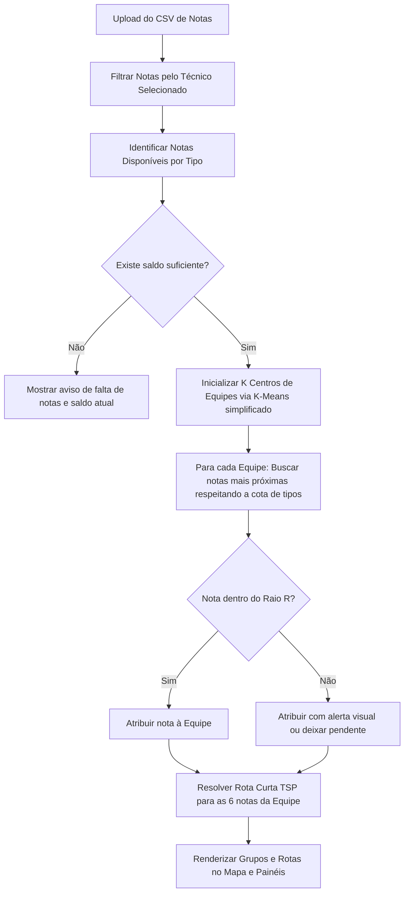

# Plano de Implementação: Agrupador de Notas Geográfico (Ordens de Serviço)

Este plano descreve a arquitetura, algoritmo e interface de usuário para o **Agrupador Inteligente de Notas**, resolvendo o problema de divisão de ordens de serviço por equipes com base em restrições geográficas, especialidades (tipos de notas) e capacidade por equipe.

---

## 1. Análise e Sugestões de Melhoria

A sua ideia inicial é excelente e resolve um problema clássico de logística de campo (Roteamento de Veículos / Agrupamento com Restrição de Capacidade). Para tornar esta ferramenta extremamente eficiente, robusta e fácil de usar no dia a dia, sugerimos as seguintes **melhorias estruturais e algorítmicas**:

### 1.1. Tratamento de Restrições Flexíveis (Soft Constraints)
No mundo real, as coordenadas das notas nem sempre se encaixam perfeitamente nos limites definidos. Se você exigir **rigorosamente** 4 MDFC e 2 ALGC dentro de um raio rígido de $X$ metros, existem três grandes riscos:
*   **Ausência de Solução:** O algoritmo pode falhar se não houver exatamente essa proporção de notas próximas geograficamente.
*   **Sobras Isoladas:** Algumas notas muito distantes ficarão sem equipe (órfãs).
*   **Ineficiência:** Equipes podem cruzar caminhos desnecessariamente para satisfazer a cota rígida de tipos.
*   > [!TIP]
    > **Melhoria Proposta:** Implementar um **algoritmo heurístico adaptativo** com prioridades. O sistema tentará alcançar a meta exata (ex: 4 MDFC + 2 ALGC). Se não for possível dentro do raio configurado, ele poderá:
    > 1. Buscar a nota do tipo requerido mais próxima, mesmo que ultrapasse ligeiramente o raio, sinalizando um alerta visual.
    > 2. Sugerir uma composição alternativa (ex: 3 MDFC, 3 ALGC) se estiver geograficamente mais compacta.
    > 3. Deixar a vaga em aberto e criar um grupo "Pendente" para que o supervisor decida.

### 1.2. Otimização de Rota Interna (Traveling Salesman Problem - TSP)
Uma vez que o grupo de 6 notas é atribuído a uma equipe, a ordem em que elas são executadas importa muito para reduzir o tempo de deslocamento.
*   > [!TIP]
    > **Melhoria Proposta:** Após agrupar as 6 notas de uma equipe, ordenar as notas de forma a **minimizar a distância total percorrida** (resolvendo o problema do caixeiro viajante para as 6 notas). O mapa desenhará a linha sugerida conectando os pontos de 1 a 6.

### 1.3. Ajuste Manual Interativo (Drag and Drop / Clique no Mapa)
Algoritmos são ótimos, mas a intuição do supervisor é insubstituível. Podem existir barreiras geográficas reais que o algoritmo não vê (rios, rodovias de acesso difícil, etc.).
*   > [!IMPORTANT]
    > **Melhoria Proposta:** Permitir que o usuário clique em uma nota atribuída à Equipe A no mapa e a **transfira manualmente** para a Equipe B. O sistema irá recalcular instantaneamente as métricas de ambas as equipes (composição, raio máximo e rota).

### 1.4. Análise de Viabilidade Prévia (Indicadores em Tempo Real)
*   **Melhoria Proposta:** Antes de rodar o agrupamento completo, mostrar um painel com o balanço geral da base importada:
    *   Total de notas do Técnico selecionado por tipo.
    *   Comparativo: Necessidade Total (ex: 10 equipes $\times$ 4 MDFC = 40 MDFC necessárias) vs. Disponibilidade Real (ex: 38 MDFC importadas). Se faltarem notas, avisar o usuário imediatamente antes do processamento.

---

## 2. Arquitetura da Aplicação Proposta

Propomos uma **Aplicação Web Monopágina (SPA)** moderna, rápida e visualmente deslumbrante, rodando inteiramente no navegador (sem necessidade de servidor complexo para o processamento, garantindo privacidade dos dados e velocidade instantânea).

### 2.1. Tecnologia Stack
1.  **Interface e Estrutura:** HTML5 e Javascript Moderno (ES6+).
2.  **Estilo & Design:** Vanilla CSS com variáveis para um tema escuro/claro elegante, efeitos de Glassmorphism (efeito vidro), transições suaves e layout responsivo.
3.  **Visualização de Mapas:** [Leaflet.js](https://leafletjs.com/) (biblioteca leve de mapas interativos de alto desempenho) integrada com OpenStreetMap.
4.  **Processamento Algorítmico:** Heurística de agrupamento baseada na distância de Haversine (cálculo de distância em linha reta sobre a superfície da Terra considerando a curvatura terrestre).

---

## 3. Estrutura do Projeto [NEW]

Criaremos o projeto no diretório scratch do usuário sob a pasta:
`C:\Users\josep\.gemini\antigravity\scratch\agrupador-notas`

```
agrupador-notas/
├── index.html          # Interface principal estruturada e semântica
├── index.css           # Design System, variáveis CSS, temas e animações
├── app.js              # Controlador principal da aplicação e mapa
├── algorithm.js        # Motor de agrupamento geográfico inteligente e TSP
└── sample_data.csv     # Arquivo de exemplo para o usuário testar a ferramenta
```

---

## 4. O Algoritmo de Agrupamento Proposto (Passo a Passo)

O motor contido em `algorithm.js` operará da seguinte forma:



1.  **Haversine Distance:** Cálculo exato em metros entre as coordenadas GPS das notas.
2.  **K-Means Centroid Seeding:** Identifica os pontos mais densos da base para posicionar as equipes (ex: se precisamos de 10 equipes, achamos os 10 "centros de gravidade" de notas).
3.  **Typed Greedy Assignment:** A partir dos centros, o algoritmo expande em espiral buscando os tipos necessários (ex: os 4 MDFCs mais próximos do centro, depois os 2 ALGCs mais próximos).
4.  **TSP Local:** Aplicação do algoritmo do vizinho mais próximo para organizar as 6 notas em um caminho fluido.

---

## 5. Mockup Visual e Recursos Premium da UI

A interface será construída seguindo as diretrizes de **Design Premium** do Antigravity:
*   **Dark Mode Nativo:** Fundo escuro profundo (`#0f172a`), com cartões translúcidos (`backdrop-filter: blur()`).
*   **Cores Harmoniosas:** Cada tipo de nota terá uma cor neon suave correspondente no mapa (ex: MDFC = Azul Ciano `#06b6d4`, ALGC = Esmeralda `#10b981`, APRO = Roxo `#a855f7`).
*   **Mapa Interativo:** Mapa ocupando 60% da tela, com marcadores customizados e linhas de rota elegantes ligando as notas de cada equipe.
*   **Painel Lateral de Configuração:**
    *   Área de upload (Drag & Drop) com feedback animado de linhas carregadas.
    *   Seletores dropdown para escolher o Técnico.
    *   Configuração do Raio Limite (Slider de 100m a 10km).
    *   Tabela interativa para definir a regra de composição (ex: "Quantas notas de cada tipo por equipe?").
*   **Painel de Resultados:** Tabela detalhada das equipes. Ao clicar em uma equipe, o mapa faz um zoom suave (flyTo) para o grupo e destaca a rota correspondente.
*   **Download de Modelo:** Link para baixar um CSV pré-configurado para que você possa testar imediatamente com dados fictícios gerados por nós.

---

## 6. Plano de Verificação

### Testes Manuais de Usabilidade
1.  **Importação de Dados:** Testar com arquivos CSV válidos e inválidos (sem lat/long, colunas em branco) para garantir que a aplicação trate os erros de forma amigável.
2.  **Variação de Parâmetros:** Alterar o raio limite e a quantidade de equipes dinamicamente para verificar se o algoritmo reconstrói os grupos em menos de 100ms.
3.  **Edição Manual:** Verificar se a transferência manual de notas atualiza as estatísticas e as linhas do mapa instantaneamente.
4.  **Exportação:** Garantir que o CSV gerado para download contenha todos os dados organizados com o número da equipe e a ordem de visita.

---

## 7. Perguntas Abertas para o Usuário

> [!IMPORTANT]
> Para ajustar os detalhes do comportamento do algoritmo, gostaríamos de saber:
> 1. **Comportamento quando faltam notas:** Se você pedir 10 equipes (precisando de 40 MDFC), mas na região do Técnico só existirem 35 MDFC, você prefere que:
>    *   *(A)* O algoritmo crie apenas 8 equipes completas e deixe 2 equipes sem MDFC?
>    *   *(B)* O algoritmo preencha as equipes com outros tipos disponíveis (ex: ALGC)?
>    *   *(C)* Apenas alerte e deixe o usuário ajustar manualmente?
> 2. **Ponto de Partida da Equipe (Início do Raio):** O raio deve ser considerado a partir de um "centro geográfico" calculado entre as notas atribuídas, ou existe um ponto de partida fixo para cada equipe (como a base da empresa ou a casa do técnico/equipe)?
